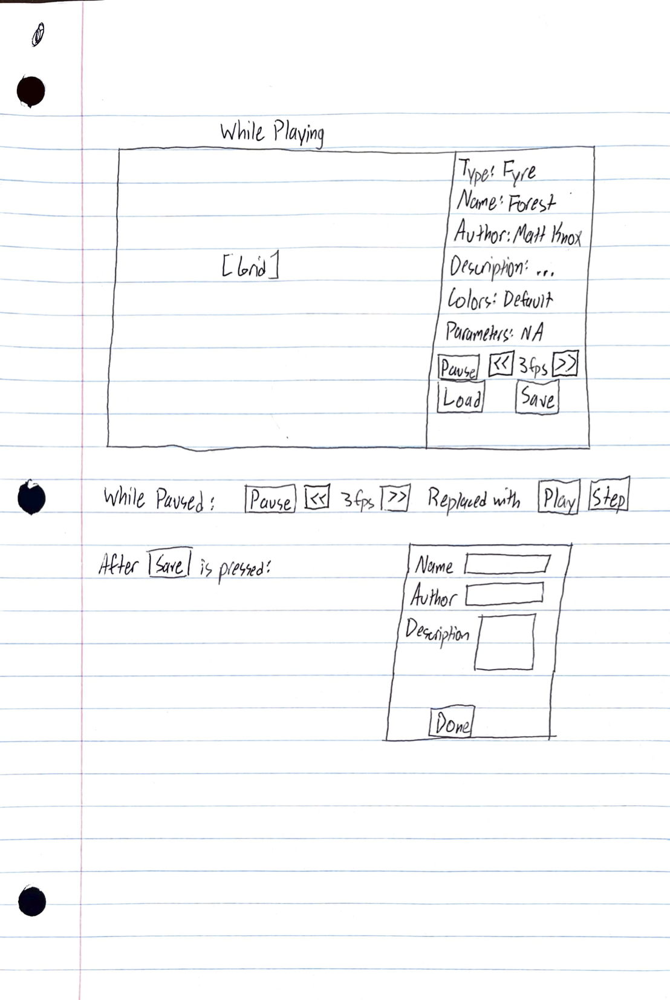

# Cell Society Design Plan
### Team Number: 5
### Names: Matt Knox, Edison Ooi, Haris Adnan

## Introduction

We are planning to design a simulation platform that hosts many different 2D Cellular Automata (CA) models, such 
as Game of Life, Spreading of Fire, etc. This simulation platform will be flexible enough to allow different CA 
models to be easily implemented. Users can interface with this program via XML config files and using the mouse/keyboard during runtime. 

## Overview

The program is split up into the following classes as shown in the CRC Cards below:

// Insert CRC Cards. 

The class Simulation is the class that sets up and controls the simulation(controls simulation progress)
and allows the user to start/stop/load the animation and increase or decrease the speed that the simulation progresses
with. This class uses the SimulationType and Grid Classes. Grid class sets up the Grid. The SimluationType class 
determines which game is being run. This Class uses the configuration class. The Configuration class imports the XML 
and uses the data inside to pass parameters to other classes.

## User Interface

The screen of this program is split into two sections: one on the left and one on the right.
The left side contains the 2D grid of cells that shows the simulation.
The right side contains data about the running simulation and buttons for the user to press. 
The data shown on the right side displays the following:
* Type
* Name
* Author
* Description
* Colors
* Parameters

There are two rows of buttons the user can press. 
The first row contains buttons and information about the speed of the simulation,
and the second row contains buttons to save and load simulations. 

While playing, the first row contains:
* Button: Pause
* Button: Slow down
* Information: current speed
* Button: Speed up

While paused, the first row contains:
* Button: Play
* Button: Step (steps through the simulation by one cycle)

When __load__ is pressed, a system dialogue comes up, where the user can select a new simulation file to load. 

When __save__ is pressed, the right side is replaced by a series of text fields for the user to enter information about the file to save:
* Name
* Author
* Description
* Button: Done

The user presses __done__ when they are done. 

Any runtime errors that occur will also be shown on the right side. 
Errors include, but are not limited to:
* Did not select XML file when loading file
* XML file is formatted incorrectly
* XML file has missing values

A summary of the UI is shown here:

## Configuration File Format
See data folder for specific config file examples. One just lists all of
the elements in one collection, while the second organizes the elements
into many sub-collections, which makes it slightly more readable but will
take more work to parse.

## Design Details

TODO: Haris

Here is a graphical look at my design:

made from [a tool that generates UML from existing code](http://staruml.io/).

## Use Cases

# These are all the methods we have (put these on the CRC cards)
* Grid.setupGrid()
* Grid.calculate()
* Grid.update()

* Cell.calculate()
* Cell.update()
* Cell.getState()

* Simulation.setupSimulation()
* Simulation.step()
* Simulation.getParameter()
* Simulation.setParameter()
* Simulation.start()
* Simulation.stop()
* Simulation.save()
* Simulation.load()
* Simulation.speedUp()
* Simulation.slowDown()

* Configuration.getValue()
* Configuration.importXML()

* SimulationType.runAlgorithm()

#### Given use cases: 
* Apply the rules to a middle cell: set the next state of a cell to dead by counting its 
number of neighbors using the Game of Life rules for a cell in the middle (i.e., with all its neighbors)

  * Simulation calls Grid.calculate(), Grid calls Cell.calculate() on each cell. 
  Cell calls the appropriate SimulationType algorithm to determine whether it updates. 

* Apply the rules to an edge cell: set the next state of a cell to live by counting its number of neighbors using the Game of Life rules for a cell on the edge (i.e., with some of its neighbors missing)

  * Simulation calls Grid.calculate(), Grid calls Cell.calculate() on each cell. 
  Cell calls the appropriate SimulationType algorithm to determine whether it updates.

* Move to the next generation: update all cells in a simulation from their current state 
to their next state and display the result graphically

  * Simulation calls Grid.update(), Grid calls Cell.update() on each cell. 
  Each cell updates to the next state and changes color appropriately. 

* Switch simulations: load a new simulation from a data file, replacing the current running 
simulation with the newly loaded one

  * Simulation calls Simulation.load(), which updates all instance fields necessary.

* Set a simulation parameter: set the value of a parameter, 
probCatch, for a simulation, Fire, based on the value given in a data file

  * Simulation calls Simulation.getParameter(), which calls Configuration.getValue(). 
  Simulation then calls Simulation.setParameter(), which updates all instance fields necessary. 

#### Matt

* Speed up the animation rate
  * This is called when the user presses the __>>__ button. This calls Simulation.speedUp().
* Slow down the animation rate
  * This is called when the user presses the __<<__ button. This calls Simulation.slowDown().

#### Edison
* Save current simulation into an XML file to be loaded sometime later
  * Simulation.stop() would stop running calculations after the current update is finished
  * Simulation.save() might loop over each cell in the grid and save a string representing the state (alive, dead, etc)
    of each cell. This would be extracted from a getState() method on Cell. 
  It might also encode other metadata about the simulation into XML.
* Render all of the cells on the grid based on initial configuration given in XML
  * Configuration.importXML() would parse the XML file to extract all of the information needed for the current Simulation.
    It might return a new Simulation object with all of these properties, including its initial cell config.
  * Simulation.setupCells() would call Grid.setupGrid() and maybe pass in that String to create new Cell objects in a 2D
  array for that grid.

#### Haris

* Use Case 1: Starting the simulation
  * The user presses the "start" button on the UI. 
  * This button calls the Simulation.start() method and starts running the program.
  * This method will be different from the setUpSimulation() method.

* Use Case 2: Stopping the simulation
  * The user presses the "stop" button on the UI
  * This button pauses the simulation by calling the Simulation.stop() method and stops the simulation.

## Design Considerations

* How does this program speed up and slow down
  * Option 1: Method calls to the Animation object are used, 
  speeding up and slowing down the actual update rate
  * Option 2: Calculations within Simulation classs dictate whether or not to step(), 
  and the animation rate does not change. 

#### Design Issue #1: Which class is in charge of telling cells to update

 * Alernative #1
   * The overarching Simulation class, which will likely contain the main step() function for the entire simulation

 * Alernative #2
   * The Grid class, which contains the individual cells, tells the cells to update. 

 * Trade-offs
   * Using the simulation class for this will allow us to more easily use methods inside the same class to tell eache cell how to update.
   Having this done by the grid class makes the grid smarter but this may interfere with the algorithm we use.

#### Design Issue #2: What functionality should we implement and define in our "SimulationType" abstract class?

 * Alernative #1
   * Have an abstract update() function that takes a cell as a parameter and invokes the proper functions on that cell
   given the rules of this simulation type

 * Alernative #2
   * Each child class has its own update() function (possible with different parameter types).

 * Trade-offs
   * Alternative #1 allows for better inheritance hierarchy, 
   whereas alternative #2 allows for greater flexibility. 

## Team Responsibilities

 * Team Member #1: Edison
   * (Configuration & SimulationType)

 * Team Member #2: Matt
   * (Grid & Cell)

 * Team Member #3: Haris
   * (Simulation)

#### Proposed Schedule

By 1/27: Have functionality written that doesn't depend on other people's classes

By 1/30: Basic Implementation which includes:
* Basic version of all three parts of project with Model logic (no JavaFX) separated from View logic (dependent on JavaFX)
* Most of the closed classes completed
* View should get its properties from configuration files (not necessarily XML) instead of hard-coded
* 25 example config files: 3 that produce deterministic results for each simulation type, and 2 that have initial configs
will cells on the edges for each simulation type

By 2/6: Complete Implementation which includes:
* 5 different fully-working simulation types that take parameters from XML configuration files
